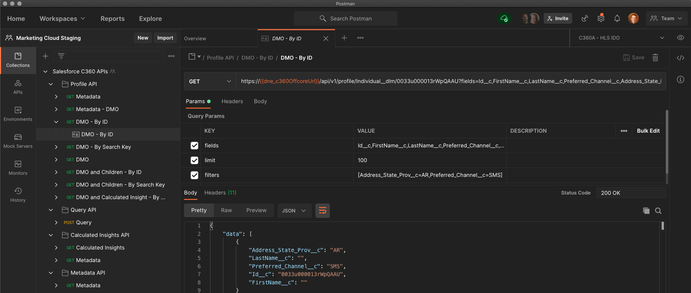
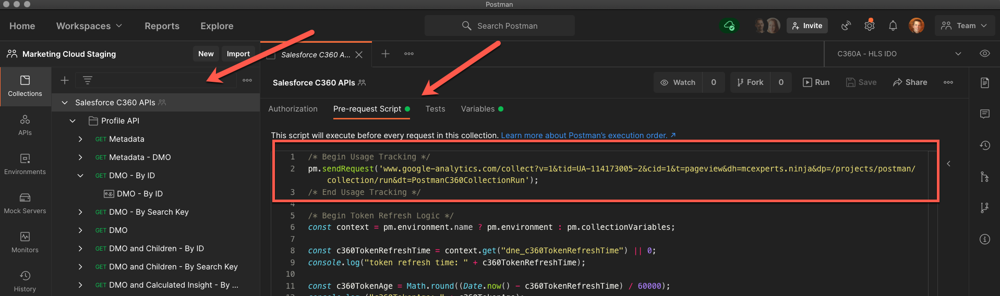

> ℹ️   **April 2021 update:** This collection is maintained as a [Postman Public Workspace](https://www.postman.com/salesforce-developers). This makes it easier to install, update and contribute to the collection. 
This repository is dedicated to hosting the setup/contribution documentation and tracking issues.

# C360 APIs for Postman

The current [Postman](https://www.postman.com) collection of consists of 11 requests for the following Salesforce C360 APIs:

<table>
   <tr>
      <td>
         <ul>
            <li>Profile API</li>
            <li>Query API</li>
            <li>Calculated Insights API</li>
            <li>Metadata</li>
         </ul>
      </td>
   </tr>
</table>

As new APIs are made available to the C360, the collection will be expanded to include those.

**⚠️  Disclaimers:**
- This collection is provided as-is. It's not officially supported by Salesforce or covered by SLAs.
- API documentation is not provided with the collection. Please refer to the [official documentation](https://developer.salesforce.com/docs/atlas.en-us.c360a_api.meta/c360a_api/c360a_api_quick_start.htm).
- To help us better understand usage of the collection, we leverage Google Analytics. If you would like to opt out of the tracking, you can remove the Pre-request Script set at the collection level.

## Issues and Questions

Report issues and ask questions [here](https://github.com/salesforce-marketingcloud/c360-postman/issues).

## Installation

This collection currently only supports the **Postman desktop app** to connect to C360 with the Salesforce C360 APIs collection. 

- [Install the Collection](install-the-collection.md)

We are evaluating the changes required to support the **Postman web app** as an alternative approch. 

## Additional Documentation

- [Keeping the collection up to date](updating.md)
- [Working With Environments To Connect To Multiple C360 Instances](working-with-environments.md)
- [Contributing](contributing.md)